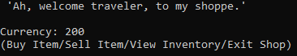

| Patrick Gilfoil |
| :--- |
| s198018 |
| Introduction to C# |
| RPGStore Documentation |

## I. Requirements

1. Description of Problem

    - Name: **RPGStore**
    - Using your knowledge of stores in modern RPGs, create a RPG Store program using the C# language.
    - The program will maintain an array of items for both the store and the player, and allow the player to purchase items from, or sell items to the store. The player will interact through text commands to perform actions with the storekeeper. The inventories and funds of both the player and the store will be saved to and loaded from a text file. The program must also demonstrate multiple levels of inheritance with items from a base 'Item' class. 

2. Input Information
    - In cases of dialogue being output upon first startup and when exiting the shop, any key input is used to progress text.
    - Selections take in string input to select items and options in menus.

3. Output Information
    - Different information is displayed dependent on each action the user performs
        - **Buy Item**: Upon selecting an item, it will show the stats of the weapon including name, description, and cost, before asking the user if they want to buy it.
        - **Sell Item**: Upon selecting an item, it will show the stats of the weapon including name, description, and cost, before asking the user if they want to sell it at a reduced price.
            - If there are no items in the user's inventory, the program will tell the user that they have no items in their inventory.
        - **View Inventory**: Upon selecting an item, the stats of the item are shown including name, description, and cost.

4. UI Information
    - ***Main Menu***: The user's current amount of currency is displayed along with the available options to select from.
        - **Buy Item**: Shows the entirety of the shop's inventory to select from.
            - Item Purchase: Item stats are shown along with a prompt for the user whether they want to purchase the item or not.
        - **Sell Item**: Shows the entirety of the player's inventory to select from.
            - Item Sell: Item stats are show along with a prompt if the user wnats to sell the item at a reduced price from the original cost
        - **View Inventory** - Show's the entirety of the player's inventory for the player to inspect an item.
            - Item Inspection - The Item's stats are shown to the player to view.
        - **Exit Shop** - The game saves and dialogue is shown about the next visit.

## II. Design
1. System Architecture

| Main Menu
| :-----

2. _User Interface_

3. ### Object Information
    ***File:*** Item.cs
    - Description: The base class that contains attributes and functions for both types of items.
    - Attributes
        - Name: _name
            - Description: Variable that stores a string for an item name.
            - Type: protected string

        - Name: _desc
            - Description: Variable that stores a string for an item description.
            - Type: protected string

        - Name: _cost
            - Description: Variable that stores an item cost for purchases.
            - Type: protected int

    - Operations
        - Name: PrintItem
            - Description: Function that prints out all of the variables an item has, vitural function.
            - Visibility: Public

        - Name: GetName
            - Description: Retrieves the name of an item.
            - Return type: string
            - Visibility: Public

        - Name: GetDesc
            - Description: Retrieves the description of an item.
            - Return type: string
            - Visibility: Public

        - Name: GetCost
            - Description: Retrieves the cost of an item.
            - Return type: int
            - Visibility: Public

        - Name: ProcessBuyItem
            - Description: Function that processes input for buying an item.
            - Arguments: string input, ref int buyerMoney, ref int sellerMoney
            - Return type: bool
            - Visibility: Public

        - Name: ProcessSellItem
            - Description: Function that processes input for selling an item.
            - Arguments: string input, ref int, buyerMoney, ref int sellerMoney
            - Return type: bool
            - Visibility: Public

        - Name: SaveItem
            - Description: Function that saves an item to a text file.
            - Arguments: StreamWriter writer
            - Visibility: Public

        - Name: LoadItem
            - Desctiption: Function that loads an item and it's information from a text file.
            - Arguments: StreamReader reader
            - Visibility: Public
